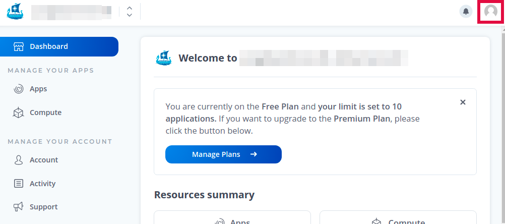
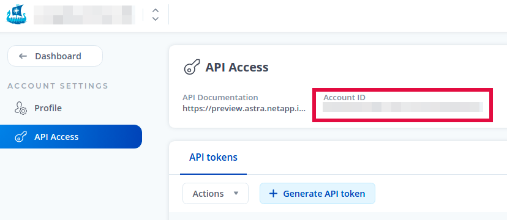

# NetApp Astra Control Python SDK

The NetApp Astra Control Python SDK is designed to provide guidance for working with the NetApp Astra Control API.

You can use the `astraSDK.py` library out of the box, and as a set of example recommended code and processes, "cookbook" style. The `toolkit.py` script is a helpful sandbox tool for learning how to use the Astra API.

We don't recommend the use of `toolkit.py` in production, but the code is heavily-documented, so you can see how the parts come together, and use it as a starting point for your own code.

## Installation

The NetApp Astra Control Toolkit can be run in a Docker container. This makes it easy for you to launch and use the SDK, because the prepared Docker image has all the dependencies and requirements configured and ready to go.

### Prerequisites

To use the prepared Docker image (recommended) to run the NetApp Astra Control Toolkit:

* One or more running compute clusters managed by NetApp Astra Control.
* Required software installed:
    * Docker 20.10.7+

To manually run the NetApp Astra Control Toolkit:

* One or more running compute clusters managed by NetApp Astra Control.
* Required software installed:
    * Python 3.5+
    * Pip 21.1.2+
    * Virtualenv 20.4.7+
    * Git 2.30.2+
    * Kubectl 1.17+
    * Azure CLI (`az`) 2.25.0+ or Google Cloud SDK (`gcloud`) 345.0.0+
    * Helm 3.2.1+

### Install Using Docker (Recommended)

Launch the prepared Docker image. Docker will automatically download the image if you don't already have it on your system.

```Shell
sudo docker run -it jpaetzel0614/k8scloudcontrol:1.1 /bin/bash
```

NOTE: From this point forward, you will be working in the Docker container you just launched.

Set up your kubeconfig to successfully run kubectl commands against your cluster with the appropriate command (e.g. `export KUBECONFIG=/path/to/kubeconfig`, `gcloud container clusters get-credentials`, or `az aks get-credentials`).

Clone the NetApp Astra Control SDK repo.

```Shell
git clone https://github.com/NetApp/netapp-astra-toolkits.git
```

Move into the repo directory.

```Shell
cd netapp-astra-toolkits
```

Edit the `config.yaml` file to add your NetApp Astra Control account information.

* `Authorization: Bearer`: Your API token
* `uid`: Your Astra Control Account ID
* `astra_project`: Your Astra Control instance (`preview` or `demo` ACC users put a FQDN here)
* `verifySSL`: True or False, useful for self-signed certs. (If this field isn't included it's treated as true)

You can find this information in your NetApp Astra Control account profile. Click the user icon in the upper right-hand corner, then choose **API Access** from the drop-down menu which appears.



Copy and paste your Astra Control account ID into the `config.yaml` file.



To get your API token, click **+ Generate API token**. Generate a new API token, then copy and paste the token into the `config.yaml`

When you are done, the `config.yaml` looks like:

```Shell
headers:
  Authorization: Bearer ABCDEFGHI0123456789
uid: 123456789-1234-123456789
astra_project: preview
```

Save and exit the file.

Run the following commands to add the required Python elements:

```Shell
virtualenv toolkit
source toolkit/bin/activate
pip install -r requirements.txt
```

You can now use `./toolkit.py` to invoke the NetApp Astra Control SDK. For example, list your Astra clusters with the command:

```Shell
./toolkit.py list clusters
```

See [the documentation](./docs) for more info.

## Install Manually

Set up your kubeconfig to successfully run kubectl commands against your cluster with the appropriate command (e.g. `export KUBECONFIG=/path/to/kubeconfig`, `gcloud container clusters get-credentials`, or `az aks get-credentials`).

Clone the NetApp Astra SDK repo.

```Shell
git clone https://github.com/NetApp/netapp-astra-toolkits.git
```

Move into the repo directory.

```Shell
cd netapp-astra-toolkits
```

Edit the `config.yaml` file to add your NetApp Astra account information.

* `Authorization: Bearer`: Your API token
* `uid`: Your Astra Account ID
* `astra_project`: Your Astra instance (`preview` or `demo`)

You can find this information in your NetApp Astra account profile. Click the user icon in the upper right-hand corner, then choose **API Access** from the drop-down menu which appears.


Copy and paste your Astra account ID into the `config.yaml` file.


To get your API token, click **+ Generate API token**. Generate a new API token, then copy and paste the token into the `config.yaml`

When you are done, the `config.yaml` looks like:

```Shell
headers:
  Authorization: Bearer ABCDEFGHI0123456789
uid: 123456789-1234-123456789
astra_project: preview
```

Save and exit the file.

Run the following commands to add the required Python elements:

```Shell
virtualenv toolkit
source toolkit/bin/activate
pip install -r requirements.txt
```

You can now use `./toolkit.py` to invoke the NetApp Astra SDK. For example, list your Astra clusters with the command:

```Shell
./toolkit.py list clusters
```

See [the documentation](./docs) for more info.
