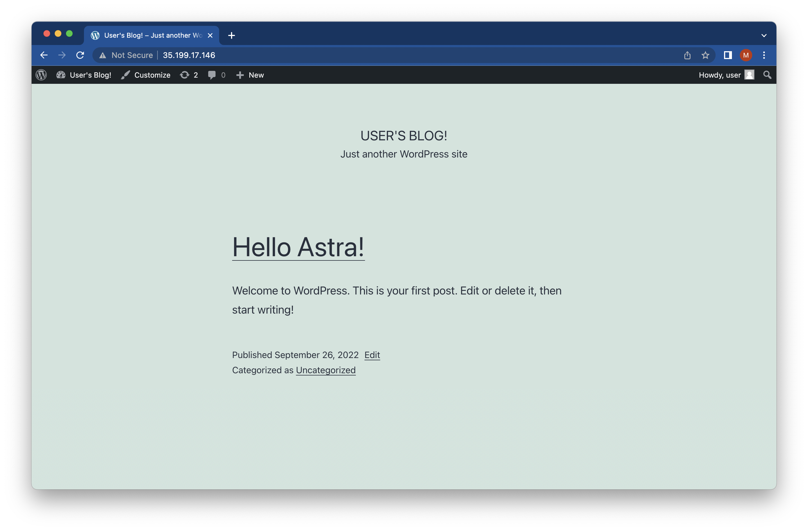
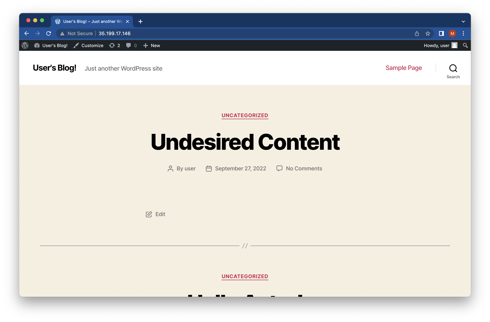

# DBaaS

The database-as-a-service integration is a proof of concept for showing how Astra Control can operate with third-party platforms which store application state.  The integration described below is based on [Google Cloud SQL](https://cloud.google.com/sql), however it can be easily extended to other DBaaS, PaaS, or IaaS solutions.

## Prerequisites

* [toolkit.py](../../../README.md#3-manual-installation): follow the steps detailed on the **Manual Installation**, but after changing into the `netapp-astra-toolkits` directory, run the following command to check out the [DBaaS branch](https://github.com/NetApp/netapp-astra-toolkits/tree/DBaaS):

    ```text
    git checkout DBaaS
    ```

* [gcloud](https://cloud.google.com/sdk/gcloud): should be installed and configured with the necessary privileges to manage Cloud SQL instances.

## Setup

In this example, we have a Wordpress application which was deployed with [./toolkit.py deploy](../deploy/README.md) (which utilizes Helm), but with an [external database](https://github.com/bitnami/charts/tree/master/bitnami/wordpress/#external-database-support):

```text
$ ./toolkit.py deploy -n wordpress wordpress bitnami/wordpress \
    --set mariadb.enabled=false \
    --set externalDatabase.host=$SQL_INSTANCE_IP \
    --set externalDatabase.password=$SQL_PASSWORD
```

This results in a managed application:

```text
$ ./toolkit.py list apps
+-----------+--------------------------------------+---------------+-------------+---------+
| appName   | appID                                | clusterName   | namespace   | state   |
+===========+======================================+===============+=============+=========+
| wordpress | c8b4f9cb-132b-4539-9bc8-5812497b3999 | prod-cluster  | wordpress   | ready   |
+-----------+--------------------------------------+---------------+-------------+---------+
```

With the following assets:

```text
$ ./toolkit.py list assets c8b4f9cb-132b-4539-9bc8-5812497b3999
+---------------------------------+-----------------------+
| assetName                       | assetType             |
+=================================+=======================+
| wordpress                       | Deployment            |
+---------------------------------+-----------------------+
| wordpress                       | PersistentVolumeClaim |
+---------------------------------+-----------------------+
| default-token-cmdpk             | Secret                |
+---------------------------------+-----------------------+
| sh.helm.release.v1.wordpress.v1 | Secret                |
+---------------------------------+-----------------------+
| wordpress                       | Secret                |
+---------------------------------+-----------------------+
| wordpress-externaldb            | Secret                |
+---------------------------------+-----------------------+
| netapp-astra-backup             | Role                  |
+---------------------------------+-----------------------+
| wordpress-65f5d44c4c-966z7      | Pod                   |
+---------------------------------+-----------------------+
| wordpress                       | Service               |
+---------------------------------+-----------------------+
| wordpress-65f5d44c4c            | ReplicaSet            |
+---------------------------------+-----------------------+
| default                         | ServiceAccount        |
+---------------------------------+-----------------------+
| netapp-astra-backup             | RoleBinding           |
+---------------------------------+-----------------------+
| kube-root-ca.crt                | ConfigMap             |
+---------------------------------+-----------------------+
```

Using a web browser, we can view our new Wordpress site:



## Backup

To back up the entire application (both the Kubernetes components and the Google Cloud SQL DB) run a [./toolkit.py create backup](../create/README.md#backup) command with the `--DBaaS-name <instance-name>` argument provided:

```text
$ ./toolkit.py create backup c8b4f9cb-132b-4539-9bc8-5812497b3999 \
    after-site-creation --DBaaS-name $SQL_INSTANCE_NAME
DBaaS wordpress-mysql-demo backup successfully initiated
Starting backup of c8b4f9cb-132b-4539-9bc8-5812497b3999
Waiting for DBaaS wordpress-mysql-demo backup to complete........complete!
Waiting for backup to complete.............................complete!
```

In addition to creating an Astra Control backup via the [takeBackup class](../../../astraSDK.py#L424), the above command also creates a backup via [gcloud sql backups create](https://cloud.google.com/sdk/gcloud/reference/sql/backups/create), specifying the gcloud backup `description` as the same as the Astra Control backup `name` (which is used for identification when restoring the app or destroying the backup).

By default, the above command waits for both the Cloud SQL and Astra Control backups to complete prior to returning the terminal prompt.  If you would prefer to immediately return the command prompt and validate the success of the backups on your own, add the optional `-b` argument:

```text
$ ./toolkit.py create backup c8b4f9cb-132b-4539-9bc8-5812497b3999 \
    after-site-creation --DBaaS-name $SQL_INSTANCE_NAME -b
DBaaS wordpress-mysql-demo backup successfully initiated
Starting backup of c8b4f9cb-132b-4539-9bc8-5812497b3999
Background backup flag selected, run 'list backups' to get status
Run 'gcloud sql backups list --instance=wordpress-mysql-demo --filter="description:after-site-creation"' to get DBaaS backup status
```

To view the completed backups, you can run the following commands:

```text
$ ./toolkit.py list backups -a c8b4f9cb-132b-4539-9bc8-5812497b3999
+--------------------------------------+---------------------+--------------------------------------+---------------+
| AppID                                | backupName          | backupID                             | backupState   |
+======================================+=====================+======================================+===============+
| c8b4f9cb-132b-4539-9bc8-5812497b3999 | after-site-creation | 48a5527d-f588-4692-b7ed-bc4ab9872f64 | completed     |
+--------------------------------------+---------------------+--------------------------------------+---------------+
```

```text
$ gcloud sql backups list --instance=$SQL_INSTANCE_NAME --filter="description:after-site-creation"
ID             WINDOW_START_TIME              ERROR  STATUS      INSTANCE
1664223768196  2022-09-26T20:22:48.196+00:00  -      SUCCESSFUL  wordpress-mysql-demo
```

## Undesired Change

In this example, our Wordpress administrator made several unauthorized changes to the blog, resulting in the following site:



## Restore

Whether the Kubernetes namespace is accidentally deleted, the Cloud SQL instance goes into an errored state, or an undesired change to the application is made, it's necessary to be able to restore the entire application to a known working state.

To restore the entire application (both the Kubernetes components and the Google Cloud SQL DB) to a known working state, run a [./toolkit.py restore](../restore/README.md) command with the `--DBaaS-name <instance-name>` argument provided:

```text
$ ./toolkit.py restore c8b4f9cb-132b-4539-9bc8-5812497b3999 \
    --backupID 48a5527d-f588-4692-b7ed-bc4ab9872f64 \
    --DBaaS-name $SQL_INSTANCE_NAME 
DBaaS wordpress-mysql-demo restore successfully initiated
Restore job in progress..............................................Success!
DBaaS restore job in progress...Success!
```

As with the [backup](#backup) command, the default restore command waits to verify a successful restore prior to returning the terminal prompt.  If desired, the prompt can be immediately returned by providing the optional `-b` argument:

```text
$ ./toolkit.py restore c8b4f9cb-132b-4539-9bc8-5812497b3999 \
    --backupID 48a5527d-f588-4692-b7ed-bc4ab9872f64 \
    --DBaaS-name $SQL_INSTANCE_NAME \
    -b
DBaaS wordpress-mysql-demo restore successfully initiated
Restore job submitted successfully
Background restore flag selected, run 'list apps' to get status
Run 'gcloud sql instances list --filter="name:wordpress-mysql-demo"' to get DBaaS status
```

## Validation

After the [restore](#restore) is complete, refresh the Wordpress site to verify it has been properly restored:


## Destroy Backup

To clean up any unneeded backups, use the normal [destroy backup](../destroy/README.md#backup) command with the `--DBaaS-name <instance-name>` argument:

```text
$ ./toolkit.py destroy backup c8b4f9cb-132b-4539-9bc8-5812497b3999 \
    48a5527d-f588-4692-b7ed-bc4ab9872f64 \
    --DBaaS-name $SQL_INSTANCE_NAME
Backup f261d333-8101-4974-9c53-442225e73848 destroyed
DBaaS wordpress-mysql-demo backup destruction successfully initiated
```
