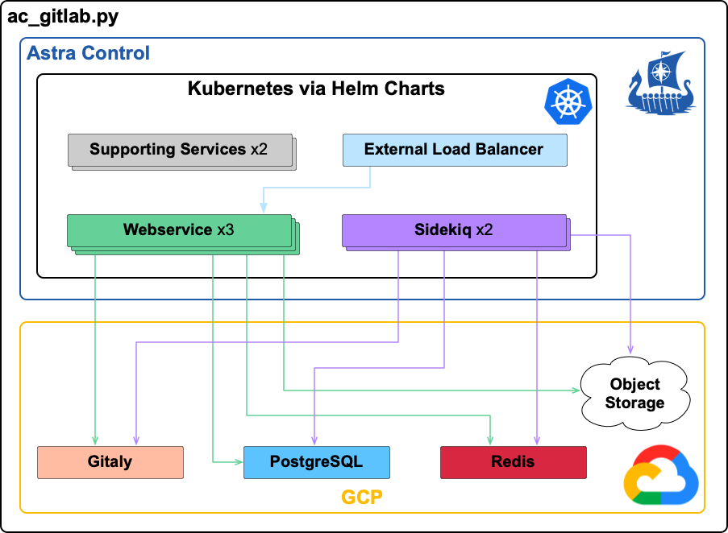

# GitLab

This example manages a fully functional, 2,000 user, cloud-native hybrid GitLab instance, per the [GitLab reference architecture](https://docs.gitlab.com/ee/administration/reference_architectures/2k_users.html#cloud-native-hybrid-reference-architecture-with-helm-charts-alternative). The hybrid architecture calls for external PostgreSQL, Redis, Gitaly, and Object Storage services, with the remaining services in Kubernetes:



This particular example utlizes GCP and `gcloud`, however this framework could easily be ported to another cloud like AWS. The command usage is as follows:

```text
python3 ac_gitlab.py <arg>
```

The available arguments are:

* [Backup](#backup)
  * [Create](#backup-create)
  * [Destroy](#backup-destroy)
  * [List](#backup-list)
* [Deploy](#deploy)
* [Destroy](#destroy)
* [Restore](#restore)

## Prerequisites

The following cloud resources must already be available prior to utilizing this example:

* A GKE cluster that:
  * has adequate CPU and memory per the [GitLab reference architecture](https://docs.gitlab.com/ee/administration/reference_architectures/2k_users.html#cluster-topology)
  * is managed by Astra Control
  * is the current context in your kubeconfig
* A domain that:
  * is owned by you or your organization
  * is managed by GCP Cloud DNS, with a DNS Zone already created
* Your local workstation with:
  * `gcloud` installed configured for your GCP environment
  * `helm` installed
  * the Astra Control Python SDK installed and configured, either via `actoolkit` or a local git repo

All other resources are automatically deployed and managed by this example. Prior to utilization, edit the [global variables](gitlab.py#L73) section of the `gitlab.py` script to match your environment:

* `APP_NAME`: optionally modify, this value represents the Kubernetes namespace (that will be created), helm release name, Astra Control application name, and the prepended value for all GCP resources that will be created
* `DB_PASSWORD`: optionally modify the random password to your desired value
* `GITALY_AUTH`: optionally modify the random password to your desired value
* `GITLAB_SHELL`: optionally modify the random password to your desired value
* `EMAIL`: must modify this to your email (used via Certmanager to generate SSL certificates)
* `GCP_NETWORK_NAME`: must modify this to the existing GCP network that your GKE cluster is deployed in (will also be used to deploy GitLab related services)
* `GCP_PROJECT`: should not need to modify, as it uses the current project per your `gcloud` setting
* `GCP_REGION`: must modify this to the existing GCP region that your GKE cluster is deployed in (will also be used to deploy GitLab related services)
* `GCP_ZONE`: must modify to any zone within `GCP_REGION`, used to deploy GitLab related services
* `GITLAB_DOMAIN`: must modify to a domain name owned by you or your organization
* `GITLAB_DNS_ZONE`: must modify to the name of the DNS Zone which manages the `GITLAB_DOMAIN`

## Backup

The `backup` argument currently supports creating an asyncronous backup (`create`), destruction (`destroy`), and listing out all existing backups (`list`).  Synchronous backups are currently planned but not yet implemented.

* [Create](#backup-create)
* [Destroy](#backup-destroy)
* [List](#backup-list)

### Backup Create

To create a backup, run the following command:

```text
python3 ac_gitlab.py backup
```

This will initiate a backup of all 5 services requiring backups (Gitaly OS disk, Gitaly Git data disk, PostgreSQL, Redis, and the Astra application).  It does not yet monitor the success or failure of these backups, however you can manually check via [list](#list).

```text
$ python3 ac_gitlab.py backup
{"type": "application/astra-appBackup", "version": "1.1", "id": "8a17ae16-5941-4abf-bfbf-290cf69965f4", "name": "gitlab-202301122135", "bucketID": "361aa1e0-60bc-4f1b-ba3b-bdaa890b5bac", "state": "pending", "stateUnready": [], "metadata": {"labels": [{"name": "astra.netapp.io/labels/read-only/triggerType", "value": "backup"}], "creationTimestamp": "2023-01-12T21:35:42Z", "modificationTimestamp": "2023-01-12T21:35:42Z", "createdBy": "8146d293-d897-4e16-ab10-8dca934637ab"}}
Redis 'gitlab-redis-demo' export successfully initiated
Cloud SQL 'gitlab-psql-demo' backup successfully initiated
Update in progress for gce snapshot gitlab-gitaly-git-disk-202301122135 [https://compute.googleapis.com/compute/v1/projects/astracontroltoolkitdev/global/operations/operation-1673559344198-5f217e638b38a-af4f610c-cea2f663] Use [gcloud compute operations describe] command to check the status of this operation.
 'gitlab-gitaly-git-disk' backup successfully initiated
Update in progress for gce snapshot gitlab-gitaly-node1-disk-202301122135 [https://compute.googleapis.com/compute/v1/projects/astracontroltoolkitdev/global/operations/operation-1673559345866-5f217e65226c6-4fec256b-fc9085b7] Use [gcloud compute operations describe] command to check the status of this operation.
 'gitlab-gitaly-node1-disk' backup successfully initiated
```

### Backup Destroy

To destroy a backup, run the following command:

```text
python3 ac_gitlab.py backup destroy <timestamp>
```

The `<timestamp>` value can be gathered from a [backup list](#list) command.

```text
$ python3 ac_gitlab.py backup destroy 202301131944
Deleted [https://www.googleapis.com/compute/v1/projects/astracontroltoolkitdev/global/snapshots/gitlab-gitaly-node1-disk-202301131944].
Deleted [https://www.googleapis.com/compute/v1/projects/astracontroltoolkitdev/global/snapshots/gitlab-gitaly-git-disk-202301131944].
Deleting backup run...done.
Deleted backup run [1673639090208].
Removing objects:
⠹Removing gs://astracontroltoolkitdev-gitlab-backup-storage/gitlab-redis-demo/gitlab-redis-demo-202301131944.rdb...
  Completed 1/1
Astra backup 2863bc3c-d167-4321-a508-0dfdf2027868 of app 650ecc00-e245-4da8-a521-d204c506ba6e destroyd
```

### Backup List

To list all available backups, run the following command:

```text
python3 ac_gitlab.py backup list
```

Each of the 5 services requiring backups (Gitaly OS disk, Gitaly Git data disk, PostgreSQL, Redis, and the Astra application) will be displayed in a chart, along with the timestamp of the backup.

```text
$ python3 ac_gitlab.py backup list
+--------------+-------------------------+--------------------------+---------------------+----------------+--------------------+
|    Timestamp | Gitaly OS Disk Backup   | Gitaly Git Disk Backup   | PostgreSQL Backup   | Redis Backup   | Astra App Backup   |
+==============+=========================+==========================+=====================+================+====================+
| 202301121654 | READY                   | READY                    | SUCCESSFUL          | READY          | completed          |
+--------------+-------------------------+--------------------------+---------------------+----------------+--------------------+
| 202301121906 | READY                   | READY                    | SUCCESSFUL          | READY          | completed          |
+--------------+-------------------------+--------------------------+---------------------+----------------+--------------------+
| 202301122135 | READY                   | READY                    | SUCCESSFUL          | READY          | completed          |
+--------------+-------------------------+--------------------------+---------------------+----------------+--------------------+
```

In the event a particular service did not complete its backup successfully, this will be displayed in the chart.

```text
$ python3 ac_gitlab.py backup list
+--------------+-------------------------+--------------------------+---------------------+-----------------+--------------------+
|    Timestamp | Gitaly OS Disk Backup   | Gitaly Git Disk Backup   | PostgreSQL Backup   | Redis Backup    | Astra App Backup   |
+==============+=========================+==========================+=====================+=================+====================+
| 202301111306 | No backup found         | READY                    | SUCCESSFUL          | No backup found | completed          |
+--------------+-------------------------+--------------------------+---------------------+-----------------+--------------------+
| 202301111421 | READY                   | READY                    | SUCCESSFUL          | No backup found | completed          |
+--------------+-------------------------+--------------------------+---------------------+-----------------+--------------------+
| 202301111425 | READY                   | READY                    | SUCCESSFUL          | READY           | completed          |
+--------------+-------------------------+--------------------------+---------------------+-----------------+--------------------+
```

## Deploy

To deploy, simply run the following command:

```text
python3 ac_gitlab.py deploy
```

The `deploy` command carries out the following actions to deploy the cloud-native hybrid GitLab instance:

1. Deploys all GCP related infrastructure, including a Gitaly VM instance, external IP address, DNS record-sets, PostgreSQL database, Redis instance, storage service account, and object storage buckets
1. Deploys all Kubernetes related infrastructure, including new namespace (matching `APP_NAME`), the necessary secrets for the GCP infrastructure, the remaining GitLab services via helm, and brings the application under Astra Control management

The expected output of the `deploy` command is:

```text
$ python3 ac_gitlab.py deploy
Creating gitlab-gitaly-cloudinit.yaml
Created [https://www.googleapis.com/compute/v1/projects/astracontroltoolkitdev/zones/us-east4-b/instances/gitlab-gitaly-demo].
NAME                ZONE        MACHINE_TYPE   PREEMPTIBLE  INTERNAL_IP  EXTERNAL_IP  STATUS
gitlab-gitaly-demo  us-east4-b  n2-standard-4               10.10.0.42                RUNNING
Creating gitlab-gitaly-secret.yaml
Creating gitlab-shell-secret.yaml
NAME                      TYPE  TTL  DATA
node1.git.astrademo.net.  A     0    10.10.0.42
Created [https://www.googleapis.com/compute/v1/projects/astracontroltoolkitdev/regions/us-east4/addresses/gitlab-external-ip].
NAME              TYPE  TTL  DATA
*.astrademo.net.  A     0    35.245.99.164
Created [https://www.googleapis.com/compute/v1/projects/astracontroltoolkitdev/global/addresses/google-managed-services-gke-prod-network].
Operation "operations/pssn.p24-239048101169-3d75d09d-7c6a-47bd-9ffa-608d3fabfa78" finished successfully.
Creating Cloud SQL instance for POSTGRES_14...done.
Created [https://sqladmin.googleapis.com/sql/v1beta4/projects/astracontroltoolkitdev/instances/gitlab-psql-demo].
NAME              DATABASE_VERSION  LOCATION    TIER              PRIMARY_ADDRESS  PRIVATE_ADDRESS  STATUS
gitlab-psql-demo  POSTGRES_14       us-east4-b  db-custom-2-8192  -                10.96.96.3       RUNNABLE
Creating Cloud SQL user...done.
Created user [gitlab].
Creating Cloud SQL database...done.
Created database [gitlabhq_production].
instance: gitlab-psql-demo
name: gitlabhq_production
project: astracontroltoolkitdev
Creating gitlab-psql-secret.yaml
Create request issued for: [gitlab-redis-demo]
Waiting for operation [projects/astracontroltoolkitdev/locations/us-east4/operations/operation-1673038350248-5f19e988fe8fc-819e27c0-02396a01] to complete...done.
Created instance [gitlab-redis-demo].
Creating gitlab-redis-secret.yaml
Created service account [gitlab-gcs].
Updated IAM policy for project [astracontroltoolkitdev].
bindings:
- members:
  - serviceAccount:dbaas-hooks@astracontroltoolkitdev.iam.gserviceaccount.com
  role: roles/cloudsql.admin
- members:
  - serviceAccount:dbaas-hooks@astracontroltoolkitdev.iam.gserviceaccount.com
  - serviceAccount:terraform-sa@astracontroltoolkitdev.iam.gserviceaccount.com
  - user:mhaigh@netapp.com
  role: roles/compute.admin
- members:
  - serviceAccount:astra-demo@astracontroltoolkitdev.iam.gserviceaccount.com
  role: roles/compute.networkViewer
- members:
  - serviceAccount:service-239048101169@compute-system.iam.gserviceaccount.com
  role: roles/compute.serviceAgent
- members:
  - serviceAccount:astra-demo@astracontroltoolkitdev.iam.gserviceaccount.com
  - serviceAccount:dbaas-hooks@astracontroltoolkitdev.iam.gserviceaccount.com
  - serviceAccount:terraform-sa@astracontroltoolkitdev.iam.gserviceaccount.com
  - user:mhaigh@netapp.com
  role: roles/container.admin
- members:
  - serviceAccount:service-239048101169@gcp-sa-gkenode.iam.gserviceaccount.com
  role: roles/container.nodeServiceAgent
- members:
  - serviceAccount:service-239048101169@container-engine-robot.iam.gserviceaccount.com
  role: roles/container.serviceAgent
- members:
  - serviceAccount:service-239048101169@containerregistry.iam.gserviceaccount.com
  role: roles/containerregistry.ServiceAgent
- members:
  - serviceAccount:dbaas-hooks@astracontroltoolkitdev.iam.gserviceaccount.com
  role: roles/dns.admin
- members:
  - serviceAccount:239048101169-compute@developer.gserviceaccount.com
  - serviceAccount:239048101169@cloudservices.gserviceaccount.com
  role: roles/editor
- members:
  - serviceAccount:terraform-sa@astracontroltoolkitdev.iam.gserviceaccount.com
  role: roles/iam.serviceAccountAdmin
- members:
  - serviceAccount:terraform-sa@astracontroltoolkitdev.iam.gserviceaccount.com
  role: roles/iam.serviceAccountUser
- members:
  - serviceAccount:astra-demo@astracontroltoolkitdev.iam.gserviceaccount.com
  - serviceAccount:terraform-sa@astracontroltoolkitdev.iam.gserviceaccount.com
  role: roles/netappcloudvolumes.admin
- members:
  - serviceAccount:service-239048101169@gcp-sa-networkmanagement.iam.gserviceaccount.com
  role: roles/networkmanagement.serviceAgent
- members:
  - user:mhaigh@netapp.com
  - user:rajeevc@netapp.com
  role: roles/owner
- members:
  - serviceAccount:service-239048101169@gcp-sa-pubsub.iam.gserviceaccount.com
  role: roles/pubsub.serviceAgent
- members:
  - serviceAccount:dbaas-hooks@astracontroltoolkitdev.iam.gserviceaccount.com
  role: roles/redis.admin
- members:
  - serviceAccount:service-239048101169@cloud-redis.iam.gserviceaccount.com
  role: roles/redis.serviceAgent
- members:
  - serviceAccount:terraform-sa@astracontroltoolkitdev.iam.gserviceaccount.com
  role: roles/resourcemanager.projectIamAdmin
- members:
  - serviceAccount:terraform-sa@astracontroltoolkitdev.iam.gserviceaccount.com
  role: roles/servicenetworking.networksAdmin
- members:
  - serviceAccount:service-239048101169@service-networking.iam.gserviceaccount.com
  role: roles/servicenetworking.serviceAgent
- members:
  - serviceAccount:astra-demo@astracontroltoolkitdev.iam.gserviceaccount.com
  role: roles/serviceusage.serviceUsageViewer
- members:
  - serviceAccount:astra-demo@astracontroltoolkitdev.iam.gserviceaccount.com
  - serviceAccount:gitlab-gcs@astracontroltoolkitdev.iam.gserviceaccount.com
  role: roles/storage.admin
- members:
  - serviceAccount:dbaas-hooks@astracontroltoolkitdev.iam.gserviceaccount.com
  role: roles/storage.objectAdmin
etag: BwXxnqoEAlA=
version: 1
created key [21e092f288f6eb97bbd04c570836bebead825ae2] of type [json] as [gitlab-storage.config] for [gitlab-gcs@astracontroltoolkitdev.iam.gserviceaccount.com]
Creating gitlab-registry-storage.yaml
Creating gitlab-rails.yaml
Creating gs://astracontroltoolkitdev-gitlab-artifacts-storage/...
Creating gs://astracontroltoolkitdev-gitlab-backup-storage/...
Creating gs://astracontroltoolkitdev-gitlab-tmp-storage/...
Creating gs://astracontroltoolkitdev-gitlab-dependencyproxy-storage/...
Creating gs://astracontroltoolkitdev-gitlab-externaldiffs-storage/...
Creating gs://astracontroltoolkitdev-gitlab-lfs-storage/...
Creating gs://astracontroltoolkitdev-gitlab-packages-storage/...
Creating gs://astracontroltoolkitdev-gitlab-pseudonymizer-storage/...
Creating gs://astracontroltoolkitdev-gitlab-tfstate-storage/...
Creating gs://astracontroltoolkitdev-gitlab-uploads-storage/...
Creating gs://astracontroltoolkitdev-gitlab-registry-storage/...
Creating gitlab-values.yaml
"gitlab" already exists with the same configuration, skipping
Hang tight while we grab the latest from your chart repositories...
...Successfully got an update from the "gitlab" chart repository
...Successfully got an update from the "cloudbees" chart repository
...Successfully got an update from the "bitnami" chart repository
...Successfully got an update from the "eks" chart repository
...Successfully got an update from the "jfrog" chart repository
Update Complete. ⎈Happy Helming!⎈
namespace/gitlab created
Context "gke_astracontroltoolkitdev_us-east4-a_prod-cluster" modified.
secret/gitlab-postgresql-password created
secret/gitlab-redis-secret created
secret/gitlab-gitaly-token created
secret/gitlab-shell-token created
secret/registry-storage created
secret/storage-config created
secret/object-storage created
NAME: gitlab
LAST DEPLOYED: Fri Jan  6 15:57:42 2023
NAMESPACE: gitlab
STATUS: deployed
REVISION: 1
NOTES:
=== NOTICE
The minimum required version of PostgreSQL is now 12. See https://gitlab.com/gitlab-org/charts/gitlab/-/blob/master/doc/installation/upgrade.md for more details.

=== WARNING
Automatic TLS certificate generation with cert-manager is disabled and no TLS certificates were provided. Self-signed certificates were generated.

You may retrieve the CA root for these certificates from the `gitlab-wildcard-tls-ca` secret, via the following command. It can then be imported to a web browser or system store.

  kubectl get secret gitlab-wildcard-tls-ca -ojsonpath='{.data.cfssl_ca}' | base64 --decode > gitlab.astrademo.net.ca.pem

If you do not wish to use self-signed certificates, please set the following properties:
- global.ingress.tls.secretName
OR
- global.ingress.tls.enabled (set to `true`)
- gitlab.webservice.ingress.tls.secretName
- registry.ingress.tls.secretName
Help us improve the installation experience, let us know how we did with a 1 minute survey:https://gitlab.fra1.qualtrics.com/jfe/form/SV_6kVqZANThUQ1bZb?installation=helm&release=15-7

=== NOTICE
The in-chart NGINX Ingress Controller has the following requirements:
    - Kubernetes version must be 1.19 or newer.
    - Ingress objects must be in group/version `networking.k8s.io/v1`.
Waiting for Astra to discover the namespace
Managing app: gitlab
App managed!

Success! Open your browser to https://gitlab.astrademo.net and log in with:
root / uIP7FQGEjMis9oVOoc3llffoCKRaTymhN1wD8rK1CKVbtQQDgSi7eUE6G1gPvNxw
```

Use the credentials provided at the bottom of the above input to log into your GitLab environment:


Follow the **New project** wizard to create a new project (in this example **Hugo** was chosen from the **create from template** option):


Navigate to the **admin** section to view the GitLab instance overview:


## Destroy

To destroy all resources created by the [deploy](#deploy) action, and any underlying backups, run the following command:

```text
python3 ac_gitlab.py destroy
```

Use with caution, as this is a destructive action without any verification. Running this command results in the following output:

```text
$ python3 ac_gitlab.py destroy
Cleaning up Astra Control resources...
Sleeping for 60 seconds for backup/snapshot cleanup...
App unmanaged
Deleted [https://www.googleapis.com/compute/v1/projects/astracontroltoolkitdev/global/snapshots/gitlab-gitaly-node1-disk-202301131950].
Deleted [https://www.googleapis.com/compute/v1/projects/astracontroltoolkitdev/global/snapshots/gitlab-gitaly-git-disk-202301131950].
Deleting backup run...done.
Deleted backup run [1673639449743].
Removing objects:
Removing gs://astracontroltoolkitdev-gitlab-backup-storage/gitlab-redis-demo/gitlab-redis-demo-202301131950.rdb...
  Completed 1/1
Deleted [https://www.googleapis.com/compute/v1/projects/astracontroltoolkitdev/global/snapshots/gitlab-gitaly-node1-disk-202301132001].
Deleted [https://www.googleapis.com/compute/v1/projects/astracontroltoolkitdev/global/snapshots/gitlab-gitaly-git-disk-202301132001].
Deleting backup run...done.
Deleted backup run [1673640080257].
Removing objects:
Removing gs://astracontroltoolkitdev-gitlab-backup-storage/gitlab-redis-demo/gitlab-redis-demo-202301132001.rdb...
  Completed 1/1
Deleted [https://dns.googleapis.com/dns/v1/projects/astracontroltoolkitdev/managedZones/astrademo-net/rrsets/node1.git.astrademo.net/A].
Deleted [https://www.googleapis.com/compute/v1/projects/astracontroltoolkitdev/zones/us-east4-b/instances/gitlab-gitaly-demo].
Removing gitlab-gitaly-cloudinit.yaml
Removing gitlab-gitaly-secret.yaml
Removing gitlab-shell-secret.yaml
Deleted [https://www.googleapis.com/compute/v1/projects/astracontroltoolkitdev/zones/us-east4-b/disks/gitlab-gitaly-node1-disk].
Deleted [https://www.googleapis.com/compute/v1/projects/astracontroltoolkitdev/zones/us-east4-b/disks/gitlab-gitaly-git-disk].
Deleting Cloud SQL instance...done.
Deleted [https://sqladmin.googleapis.com/sql/v1beta4/projects/astracontroltoolkitdev/instances/gitlab-psql-demo].
Removing gitlab-psql-secret.yaml
Delete request issued for: [gitlab-redis-demo]
Waiting for operation [projects/astracontroltoolkitdev/locations/us-east4/operations/operation-1673640917235-5f22ae45a78f1-0f6a6157-2f79e01b] to complete...done.
Deleted instance [gitlab-redis-demo].
Removing gitlab-redis-secret.yaml
deleted service account [gitlab-gcs@astracontroltoolkitdev.iam.gserviceaccount.com]
Removing gitlab-storage.config
Removing gitlab-registry-storage.yaml
Removing gitlab-rails.yaml
Removing objects:
  Completed 0
Removing Buckets:
Removing gs://astracontroltoolkitdev-gitlab-artifacts-storage/...
  Completed 1/1
Removing objects:
  Completed 0
Removing Buckets:
Removing gs://astracontroltoolkitdev-gitlab-backup-storage/...
  Completed 1/1
Removing objects:
  Completed 0
Removing Buckets:
Removing gs://astracontroltoolkitdev-gitlab-tmp-storage/...
  Completed 1/1
Removing objects:
  Completed 0
Removing Buckets:
⠹Removing gs://astracontroltoolkitdev-gitlab-dependencyproxy-storage/...
  Completed 1/1
Removing objects:
  Completed 0
Removing Buckets:
Removing gs://astracontroltoolkitdev-gitlab-externaldiffs-storage/...
  Completed 1/1
Removing objects:
  Completed 0
Removing Buckets:
Removing gs://astracontroltoolkitdev-gitlab-lfs-storage/...
  Completed 1/1
Removing objects:
  Completed 0
Removing Buckets:
Removing gs://astracontroltoolkitdev-gitlab-packages-storage/...
  Completed 1/1
Removing objects:
  Completed 0
Removing Buckets:
Removing gs://astracontroltoolkitdev-gitlab-pseudonymizer-storage/...
  Completed 1/1
Removing objects:
  Completed 0
Removing Buckets:
Removing gs://astracontroltoolkitdev-gitlab-tfstate-storage/...
  Completed 1/1
gs://astracontroltoolkitdev-gitlab-uploads-storage/user/
Removing objects:
Removing gs://astracontroltoolkitdev-gitlab-uploads-storage/user/avatar/2/alert-bot.png#1673409693427564...
Removing gs://astracontroltoolkitdev-gitlab-uploads-storage/user/avatar/3/support-bot.png#1673409699914416...
  Completed 2/2
Removing Buckets:
Removing gs://astracontroltoolkitdev-gitlab-uploads-storage/...
  Completed 1/1
Removing objects:
  Completed 0
Removing Buckets:
Removing gs://astracontroltoolkitdev-gitlab-registry-storage/...
  Completed 1/1
Deleted [https://www.googleapis.com/compute/v1/projects/astracontroltoolkitdev/global/addresses/google-managed-services-gke-prod-network].
Deleted [https://dns.googleapis.com/dns/v1/projects/astracontroltoolkitdev/managedZones/astrademo-net/rrsets/%2A.astrademo.net/A].
Deleted [https://www.googleapis.com/compute/v1/projects/astracontroltoolkitdev/regions/us-east4/addresses/gitlab-external-ip].
namespace "gitlab" deleted
Removing gitlab-values.yaml

Success! All resources destroyed.
```

## Restore

To restore the GitLab application to a backup, run the following command:

```text
python3 ac_gitlab.py restore <timestamp>
```

To gather the `timestamp` argument, run a [backup list](#backup-list) command.

As an example, here is our GitLab admin project page showing the default monitoring project, and the Hugo Docs repository we created earlier:


If we have a user that accidentally deletes our project:


Navigating back to the main GitLab page, we see that our project is now gone:


Let's restore our project to a known good state:

```text
$ python3 ac_gitlab.py restore 202301122135
Astra app gitlab restore successfully initiated
Cloud SQL gitlab-psql-demo restore successfully initiated
Request issued for: [gitlab-redis-demo]
Check operation [projects/astracontroltoolkitdev/locations/us-central1/operations/operation-1674583015674-5f3063dcbd26b-25d64d1b-5618c685] for status.
done: false
metadata:
  '@type': type.googleapis.com/google.cloud.redis.v1.OperationMetadata
  apiVersion: v1
  cancelRequested: false
  createTime: '2023-01-24T17:56:55.690151370Z'
  target: projects/astracontroltoolkitdev/locations/us-central1/instances/gitlab-redis-demo
  verb: import
name: projects/astracontroltoolkitdev/locations/us-central1/operations/operation-1674583015674-5f3063dcbd26b-25d64d1b-5618c685
Redis gitlab-redis-demo import successfully initiated
Stopping instance(s) gitlab-gitaly-demo...done.
Updated [https://compute.googleapis.com/compute/v1/projects/astracontroltoolkitdev/zones/us-central1-b/instances/gitlab-gitaly-demo].
Updated [https://www.googleapis.com/compute/v1/projects/astracontroltoolkitdev/zones/us-central1-b/instances/gitlab-gitaly-demo].
Updated [https://www.googleapis.com/compute/v1/projects/astracontroltoolkitdev/zones/us-central1-b/instances/gitlab-gitaly-demo].
Deleted [https://www.googleapis.com/compute/v1/projects/astracontroltoolkitdev/zones/us-central1-b/disks/gitlab-gitaly-node1-disk].
Deleted [https://www.googleapis.com/compute/v1/projects/astracontroltoolkitdev/zones/us-central1-b/disks/gitlab-gitaly-git-disk].
Created [https://www.googleapis.com/compute/v1/projects/astracontroltoolkitdev/zones/us-central1-b/disks/gitlab-gitaly-node1-disk].
NAME                      ZONE           SIZE_GB  TYPE         STATUS
gitlab-gitaly-node1-disk  us-central1-b  10       pd-standard  READY
Created [https://www.googleapis.com/compute/v1/projects/astracontroltoolkitdev/zones/us-central1-b/disks/gitlab-gitaly-git-disk].
NAME                    ZONE           SIZE_GB  TYPE         STATUS
gitlab-gitaly-git-disk  us-central1-b  100      pd-standard  READY
Updated [https://www.googleapis.com/compute/v1/projects/astracontroltoolkitdev/zones/us-central1-b/instances/gitlab-gitaly-demo].
Updated [https://www.googleapis.com/compute/v1/projects/astracontroltoolkitdev/zones/us-central1-b/instances/gitlab-gitaly-demo].
Start instance in progress for [https://www.googleapis.com/compute/v1/projects/astracontroltoolkitdev/zones/us-central1-b/operations/operation-1674583117727-5f30643e106ca-fbe3e269-43ebaf84].
Use [gcloud compute operations describe URI] command to check the status of the operation(s).
Waiting for gitlab application to finish restoration...success!

gitlab application successfully restored
```

Once the app is finished restoring, refresh the UI, and you'll see the Hugo Docs project is available and fully functional:


